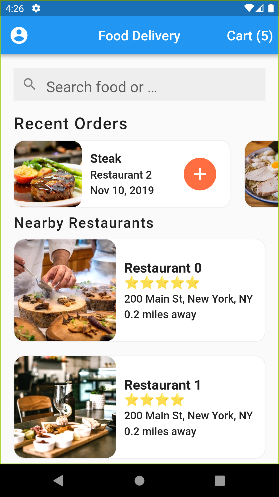
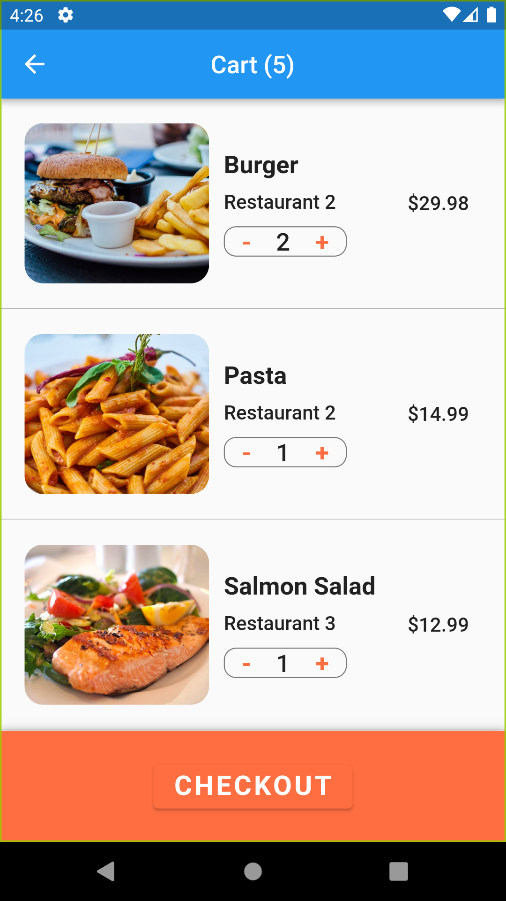

# Food Delivery User Interface (UI)

A beautiful modern interface for a food delivery app.

### Demo

&nbsp;&nbsp;&nbsp;&nbsp;&nbsp;&nbsp;&nbsp;&nbsp;&nbsp;&nbsp;&nbsp;&nbsp;&nbsp;&nbsp;&nbsp;

## Installation

##### 1. Clone the repository

```bash
git clone https://github.com/edilsonmatola/food_delivery_ui_flutter.git
```

##### 2. Move to the desired folder

```bash
cd food_delivery_ui_flutter
```

##### 3. To run the app, simply write the following commands:

```bash
flutter pub get
# flutter emulators --launch "emulator_id" (to get Android Simulator)
open -a simulator (to get iOS Simulator)
flutter run
flutter run -d chrome --web-renderer html (to see the best output)
```
